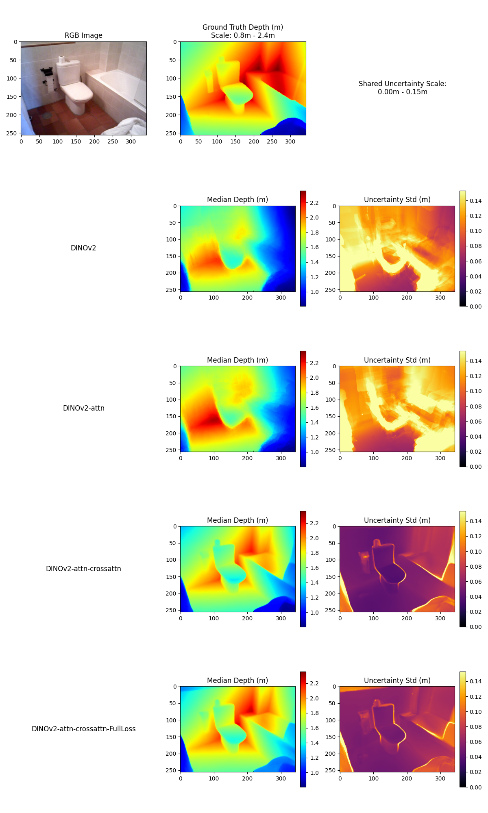
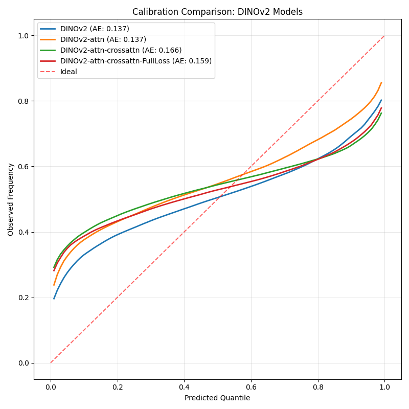

# Monocular Depth Estimation via Flow Matching

A PyTorch implementation of conditional flow matching for monocular depth estimation, trained on the SUN RGB-D dataset. The model learns a vector field that transports Gaussian noise to a depth map, conditioned on an RGB image. The architecture uses a UNet backbone with FiLM conditioning and multi-scale cross-attention powered by a pretrained **DINOv2** encoder.

---

## Quantitative Results

Metrics are computed on a held-out SUN RGB-D test set using metric depth (metres). The reported depth prediction is the **median over 100 stochastic inference passes**. Calibration Area Error (AE) measures the reliability of the resulting uncertainty map.

| Model Variant | Abs Rel ↓ | RMSE ↓ | RMSE log ↓ | δ<1.25 ↑ | δ<1.25² ↑ | δ<1.25³ ↑ | Calib. AE ↓ |
| :--- | :---: | :---: | :---: | :---: | :---: | :---: | :---: |
| DINOv2 (Base) | 0.224 | 0.655 | 0.263 | 0.671 | 0.886 | 0.956 | **0.137** |
| DINOv2 + Attn | 0.228 | 0.652 | 0.257 | 0.677 | 0.888 | 0.964 | **0.137** |
| **DINOv2 + Attn + Cross-Attn** | **0.174** | **0.531** | **0.212** | **0.763** | **0.925** | **0.978** | 0.166 |
| DINOv2 + Attn + Cross-Attn + FullLoss | 0.193 | 0.559 | 0.222 | 0.754 | 0.916 | 0.969 | 0.159 |

> **FullLoss** adds auxiliary loss terms on top of the base `L1` velocity loss: `--edge_weight 1.0 --si_weight 0.5 --x1_weight 1.0`.

---

## Qualitative Results

Because flow matching defines a stochastic posterior, multiple inference passes yield both a deterministic **Median Depth** and a pixel-wise **Uncertainty Map (Standard Deviation)**.

### Model Comparison Grid
*Ground truth and median predictions share a dynamic colormap locked to the metric range of the true depth. Uncertainty uses a fixed 0–1.5 m scale.*



### Flow Evolution
*Logarithmic frame pacing; more frames are sampled near t=1 where scene structure solidifies.*


### Uncertainty Calibration
*Reliability diagrams showing expected vs. observed quantiles across valid pixels.*



---

## Repository Structure

```
├── models.py             # UNet_FM, ViT/ResNet encoders, MHA self- and cross-attention, positional embeddings
├── datasets.py           # sun_depth_dataset, nyu_depth_dataset
├── readers.py            # SUN RGB-D and NYU-v2 file loaders, dataset manifest caching
├── losses.py             # FlowMatchingLoss (v-loss, x1-loss, gradient, edge-aware, SI)
├── train_FM.py           # Training loop, EMA, DDP metric sync, validation
├── run_experiment.py     # Entry point: CLI overrides, DDP init, MLflow logging, checkpointing
├── compare_dinov2.py     # Multi-model evaluation: metrics table, comparison grids, calibration, GIFs
├── evolve.py             # Heun ODE integration, full-resolution sliding-window inference
├── visualize_final.py    # Single-model visualizations
├── config.py             # Hyperparameters, data paths, CLI argparse
└── utils/
    ├── model_parser.py
    ├── opt_parser.py
    └── scheduler_parser.py
```

---

## Architecture

### UNet Flow Matching Model (`UNet_FM`)

The denoiser takes a noisy depth map `x_t`, scalar timestep `t`, and RGB conditioning `y`, and predicts the velocity field `v(x_t, t, y)`. All convolutions operate in `torch.channels_last` memory format.

```
x_t  (1ch, noisy depth) ──┐
                           ├─ [optional concat] ──► Down0 ──► Down1 ──► ... ──► Bottleneck
y    (3ch, RGB)         ──┘                                                          │
                                                                               self-attention
y ──► DINOv2 ──► CLS token ──► global_emb ──► FiLM at every residual block          │
             └──► patch tokens ──► scale_feats ──► cross-attn at each Up stage ◄────┘
                                                                                     │
                                                    Up0 ──► Up1 ──► ... ──► output (1ch)
```

**Key design choices:**

- **Normalization:** `LayerNorm2d` (a channel-last–compatible layer norm) is used throughout; `GroupNorm` is also supported via `norm_type`.
- **FiLM Conditioning:** Every `ResidualBlock` receives a combined `[t_emb ‖ y_global]` embedding and modulates its intermediate activations with learned `γ` and `β` projections.
- **Self-Attention:** Applied at the bottleneck. Supports **Relative Positional Bias** (`rel_bias`) and **2D SinCos** absolute positional embeddings (`sincos`).
- **Multi-Scale Cross-Attention:** Up-stages attend to spatially aligned encoder features. Positional embeddings are applied to both query and key to resolve any spatial grid mismatch between the UNet and DINOv2.

### Conditioning Encoders

**`ViT_Encoder` (DINOv2):** Uses `vit_small_patch14_dinov2` from `timm`. The first four transformer blocks are frozen. Patch tokens are projected to spatial feature maps; the CLS token is projected to a global embedding used for FiLM conditioning.

**`ResNet_Encoder`:** Pretrained ResNet18, with the `stem` and `layer1` frozen. Feature maps from the remaining stages are projected via 1×1 convolutions to exactly match the decoder's channel dimensions at each scale.

---

## Dataset — SUN RGB-D & Scale Normalization

[SUN RGB-D](https://rgbd.cs.princeton.edu/) contains indoor RGB-D images from four different sensor types. The following preprocessing pipeline corrects for sensor-specific scale and aspect-ratio variation:

1. **Bit-shift decode:** `(v >> 3) | (v << 13)` converts raw pixel values to metric depth.
2. **Border crop:** Crop to the bounding box of valid (`> 0`) depth pixels.
3. **Scale normalization:** Resize the shortest edge to `cache_size=256` (preserving aspect ratio), normalising the pixel-to-metre scale across sensors.
4. **Training augmentation:** `RandomResizedCrop(168, scale=(0.16, 1.0))` and `RandomHorizontalFlip` are applied CPU-side per sample; `ColorJitter`, `RandomGrayscale`, and `GaussianBlur` are applied on-GPU to whole batches.
5. **Inference:** Full, uncropped rectangles are processed via the sliding-window algorithm described below.

---

## Inference

### Sliding-Window (`evolve.py`)

Full-resolution rectangles are processed as overlapping `168×168` patches. Each patch is integrated with a **Heun (trapezoidal)** ODE solver and blended using a triangular weight window (`linspace(0.1→1.0) ⊗ linspace(1.0→0.1)`) to suppress seam artifacts.

### Classifier-Free Guidance

During training, `cond_drop_prob=0.10` of samples have both their global and spatial conditioning tokens replaced with learned null embeddings, training an unconditional branch. At inference, guided prediction is:

```
v_guided = v_uncond + w · (v_cond − v_uncond)
```

The `guidance_scale` sweep `[1.0, 1.5, 2.0]` is evaluated at test time.

---

## Loss Function (`losses.py`)

`FlowMatchingLoss` is a modular, mask-weighted objective. All terms are computed only over valid depth pixels.

| Term | CLI Arg | Description |
| :--- | :--- | :--- |
| `SmoothL1(β=0.1)` on `v` | `--loss L1` | Base flow-matching loss on the velocity field. |
| Reconstruction loss on `x1` | `--x1_weight` | `SmoothL1` on the predicted clean depth `x1 = xt + (1−t)·v_pred`. |
| Gradient loss | `--grad_weight` | Penalises blurry edges via first-order spatial depth gradients. |
| Edge-aware loss | `--edge_weight` | Gradient loss re-weighted by `exp(−|∇RGB|)` to emphasise boundaries at true object edges. |
| Scale-invariant loss | `--si_weight` | Log-space variance term that suppresses global scale and shift ambiguity. |

All terms are combined under a **quadratic time weighting** schedule `w(t) = t² + 0.1`, upweighting samples at high noise levels where structural learning is most critical.

---

## Training (`train_FM.py`)

**EMA:** An `AveragedModel` with `ema_decay=0.9995` shadows the live model. All validation, evaluation, and visualisation use EMA weights exclusively. Non-trainable buffers (e.g. LayerNorm running stats) are explicitly synced before evaluation via `sync_ema_buffers`.

**Mixed Precision:** `torch.amp.GradScaler` with `autocast` provides FP16 acceleration. Gradient norms are clipped to 1.0 before each optimizer step.

**Distributed Training (DDP):**
- Validation metrics (`val_total`, `val_l1`, `val_grad`, `val_si`, `val_l1_standard`) are all-reduced across ranks before logging.
- Checkpointing is main-process-only. On startup, the script attempts to resume from `model_final.pth`, falling back to `checkpoint_latest.pth`.
- Model config embedded in a checkpoint overrides the current `Config` on load, with mismatches printed as warnings.

---

## Configuration (`config.py`)

All default hyperparameters live in `utils/config.py`. Runtime overrides are applied via CLI arguments parsed in `parse_args()`.

### Model (`model_config`)

| Parameter | Default | Description |
| :--- | :---: | :--- |
| `encoder_type` | `"vit"` | Backbone encoder: `"vit"` (DINOv2) or `"resnet"` (ResNet18). |
| `filters_arr` | `[32,64,128,256]` | Channel counts through the UNet encoder stages. |
| `attn` | `True` | Enable bottleneck self-attention. |
| `cross_attn` | `True` | Enable multi-scale cross-attention in decoder. |
| `norm_type` | `"layernorm"` | Normalisation layer: `"layernorm"` or `"groupnorm"`. |
| `pos_embed_type` | `"sincos"` | Positional embedding style: `"sincos"` or `"rel_bias"`. |

### Data (`data_config`)

| Parameter | Default | Description |
| :--- | :---: | :--- |
| `cache_size` | `256` | Shortest edge (px) after scale normalisation, before cropping. |
| `side_pixels` | `168` | Square crop size (px) for training and inference windows. |
| `batch_size` | `8` | Per-GPU batch size. |
| `log_depth` | `True` | Map depth to log-space before normalising to `[−1, 1]`. |

### Training (`training_config`)

| Parameter | Default | Description |
| :--- | :---: | :--- |
| `lr` / `epochs` | `3e-4` / `300` | Peak LR for `OneCycleLR` and maximum training epochs. |
| `scheduler` | `"OneCycleLR"` | LR scheduler. Also supports `"ReduceLROnPlateau"`. |
| `cond_drop_prob` | `0.10` | Conditioning drop probability for classifier-free guidance. |
| `ema_decay` | `0.9995` | EMA decay coefficient. |
| `time_sampling` | `"uniform"` | Timestep distribution: `"uniform"` or `"logit_normal"`. |
| `guidance_scale` | `[1.0,1.5,2.0]` | CFG scale values evaluated at test time. |

---

## Installation & Usage

```bash
git clone <repo>
cd <repo>
pip install -r requirements.txt
cp .env.example .env  # set DATA_MYSUNRGBD_DIR, MLFLOW_DIR, etc.
```

**Single GPU:**
```bash
python src/run_experiment.py --run_name "DINOv2-custom" --attn True --cross_attn True
```

**Multi-GPU (DDP):**
```bash
torchrun --nproc_per_node=NUM_GPUS src/run_experiment.py --loss L1 --si_weight 0.5
```

**Multi-model evaluation and comparison:**
```bash
torchrun --nproc_per_node=NUM_GPUS src/compare_dinov2.py
```

### CLI Overrides

| Argument | Description |
| :--- | :--- |
| `--run_name` | MLflow run name. |
| `--loss` | Base loss function (`L1`, `MSE`). |
| `--encoder_type` | `vit` or `resnet`. |
| `--attn` / `--cross_attn` | Toggle attention modules (`True` / `False`). |
| `--edge_weight`, `--si_weight`, `--x1_weight`, `--grad_weight` | Auxiliary loss weights. |

---

## Acknowledgements

- [SUN RGB-D](https://rgbd.cs.princeton.edu/) — Song et al., CVPR 2015
- [Flow Matching for Generative Modelling](https://arxiv.org/abs/2210.02747) — Lipman et al., ICLR 2023
- [DINOv2](https://arxiv.org/abs/2304.07193) — Oquab et al., 2023
- [Classifier-Free Diffusion Guidance](https://arxiv.org/abs/2207.12598) — Ho & Salimans, 2022